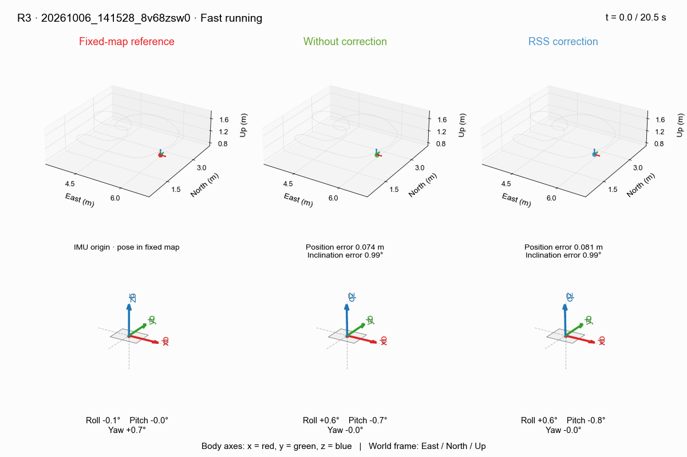
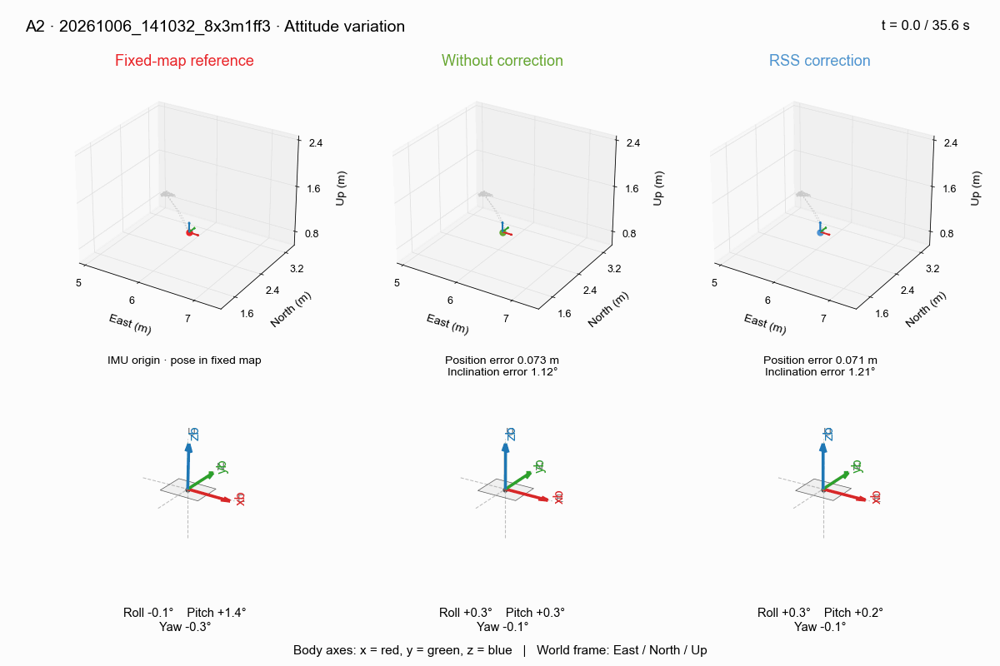
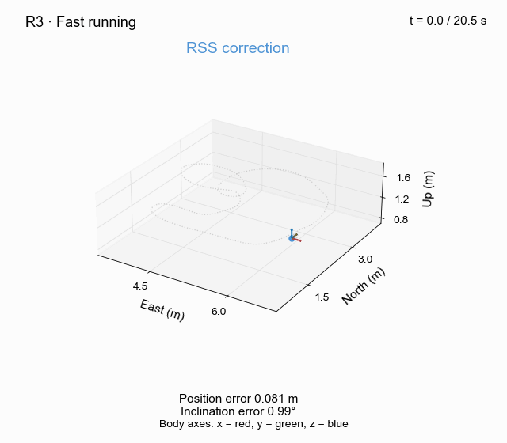
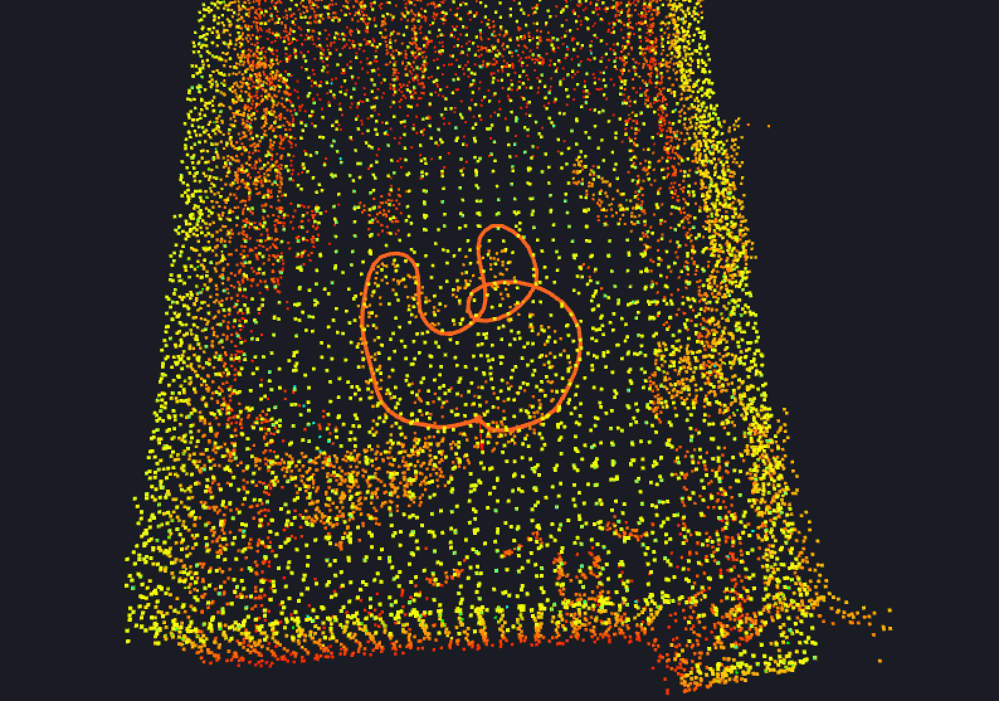

# OB_GINS_VLP

## Optimization-Based VLP/INS Integrated Navigation System

OB_GINS_VLP is derived from [OB_GINS](https://github.com/i2Nav-WHU/OB_GINS), commit df40ea5e3226c4cd8b74a9f1e55174660f7ad8de.

Loosely coupled and tightly coupled integration are both realized. We recommend you to use visual studio code on linux to run our program. We have provided the configuration files in `.vscode/`.

## 0 Highlights

IMU-aided RSS correction compensates for translation and rotation during the
DFT window before VLP/INS fusion. Both loosely and tightly coupled navigation
are supported. Enable correction with `vlp_corr: true`.

<summary>Full trajectory and attitude comparisons (R3 and A2)</summary>

The three columns compare the fixed-map reference, uncorrected navigation,
and corrected navigation. The upper row shows 3D trajectories; the lower row
shows rotating body axes and roll/pitch/yaw.

**Running experiment (R3)**



**Attitude experiment (A2)**



## 1 Prerequisites

### 1.1 System and compiler

Use Linux with GCC/G++ 8 or newer and CMake 3.12 or newer. On Ubuntu/Debian,
install the standard build tools:

```shell
sudo apt update
sudo apt install build-essential cmake
```

### 1.2 GTest (needed for new version of abseil-cpp)

```shell
sudo apt-get install libgtest-dev libgmock-dev
```

### 1.3 abseil-cpp

Follow [abseil-cpp installation instructions](https://abseil.io/docs/cpp/quickstart-cmake.html).

Don't forget to `sudo make install` after compiling.

### 1.4 Ceres

Follow [Ceres installation instructions](http://ceres-solver.org/installation.html). 

The version should be lower than 2.2.0. For example, [2.1.0](http://ceres-solver.org/ceres-solver-2.1.0.tar.gz).

### 1.5 yaml-cpp

```shell
sudo apt install libyaml-cpp-dev
```

## 2 Build OB_GINS_VLP and run demo

Once the prerequisites have been installed, you can clone this repository and build OB_GINS_VLP as follows:

```shell
# Clone the repository
git clone git@github.com:ShawnSun95/OB_GINS_VLP.git

# Build OB_GINS
cd OB_GINS_VLP
mkdir build && cd build

# gcc
cmake ../ -DCMAKE_BUILD_TYPE=Release

make -j4

# Run demo dataset
cd ..
./bin/ob_gins_vlp ./config/1203c0.yaml

# Wait until the program finish
```

## 3 Plot the results and evaluate the accuracy

The plotting script saves PNG figures beside `--optimized_poses` by default.
Add `--show` to also open plot windows. `--ground_truth` and `--initial_poses`
are optional; initial poses are displayed but do not enter the error calculation.

For the 1203 reference file, XY already have the navigation output's order,
but height is positive upward. Use `--ground_truth_frame neu` to negate only Z:

```shell
python3 ./script/plot_results.py \
  --optimized_poses ./dataset/1203/OB_GINS_TXT.nav \
  --ground_truth ./dataset/1203/ground_truth_2022123_185806.txt \
  --ground_truth_frame neu \
  --initial_poses ./dataset/1203/temp.nav
```

`plot_results.py` assumes the navigation files are NED (North, East, Down).
Choose the reference convention explicitly:

| `--ground_truth_frame` | Reference position columns | Conversion to navigation coordinates |
|---|---|---|
| `ned` (default) | North, East, Down | No conversion; preserves previous behavior |
| `neu` | North, East, Up | Keep XY and negate Z |
| `enu` | East, North, Up | Swap X/Y and negate Z |

The conversion applies to **both plots and error metrics**, only for the reference
positions. It does not modify files, navigation poses, timestamps, or origins.
There is no automatic frame detection or fitted trajectory alignment.

The frame options above describe `plot_results.py`; `plot_results_3d.py` has its
own frame options (see its `--help`).

### Reference trajectory conversion

Convert a TUM trajectory to ground-truth data:

```shell
python3 script/convert_tum_ground_truth.py \
  --input dataset/20261004_172418_6v31v_xy/trajectory.tum \
  --output dataset/20261004_172418_6v31v_xy/ground_truth_ned.txt \
  --xyz 6.3 2.25 1.01 \
  --rpy 0 0 0 \
  --rate 10
```

- `--input`: Required TUM file, columns `t x y z qx qy qz qw` (seconds, metres).
- `--output`: Required output file, columns `t N E D roll pitch yaw`
  (seconds, NED metres, ENU degrees).
- `--xyz E N U`: First input pose's ENU position in metres; default `6.3 2.25 1.01`.
- `--rpy R P Y`: First input pose's ENU angles in degrees, using
  `Rz(yaw) * Ry(pitch) * Rx(roll)`; default `0 0 0`.
- `--rate`: Output frequency in Hz; default `10`, aligned to `.00`, `.10`, `.20`, etc.
  Use `0` to keep original timestamps.
- `--reference-nav`: Sample at overlapping nav timestamps instead of `--rate`.
- `--time-origin`: Seconds subtracted from input timestamps; default `0`.
- `--time-offset`: Seconds added after subtraction; default `0`.

The first TUM pose is aligned to `--xyz` and `--rpy`. Positions use linear
interpolation; orientations use quaternion SLERP. Sampling stays within the input time range.

| RSS-corrected VLP/INS | FAST-LIO reference |
| :---: | :---: |
|  |  |


Or for simulation data, we write some scripts:
```shell
./script/run_simu.sh
./script/run_simu2.sh
./script/run_simu3.sh
```

If you use OB_GINS_VLP in an academic work, please consider to cite:

    @article{sun2025sana,
        title={Tightly coupled VLP/INS integrated navigation by inclination estimation and blockage handling},
        author={Sun, Xiao and Zhuang, Yuan and Yang, Xiansheng and Huai, Jianzhu and Huang, Tianming and Feng, Daquan},
        journal={Satellite Navigation},
        volume={6},
        number={1},
        pages={7},
        year={2025},
        publisher={Springer}
    }
